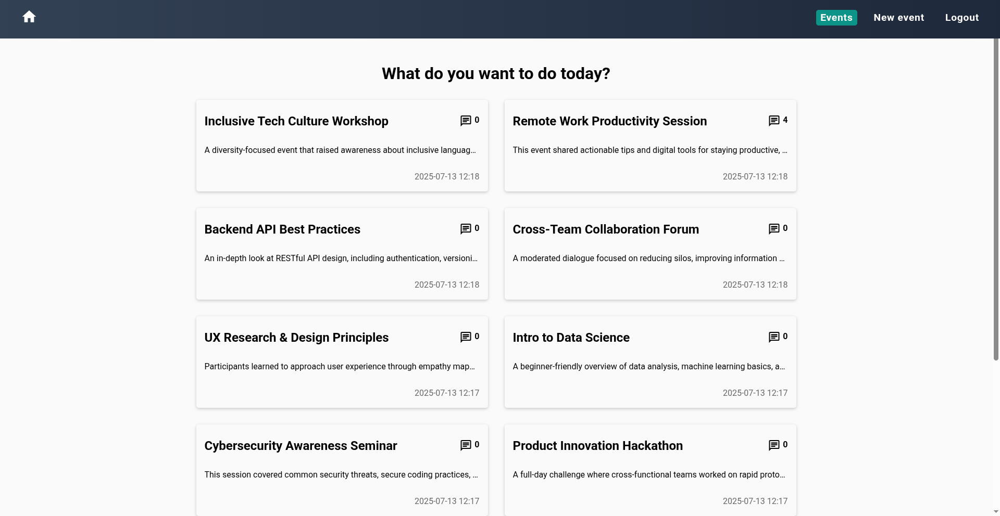
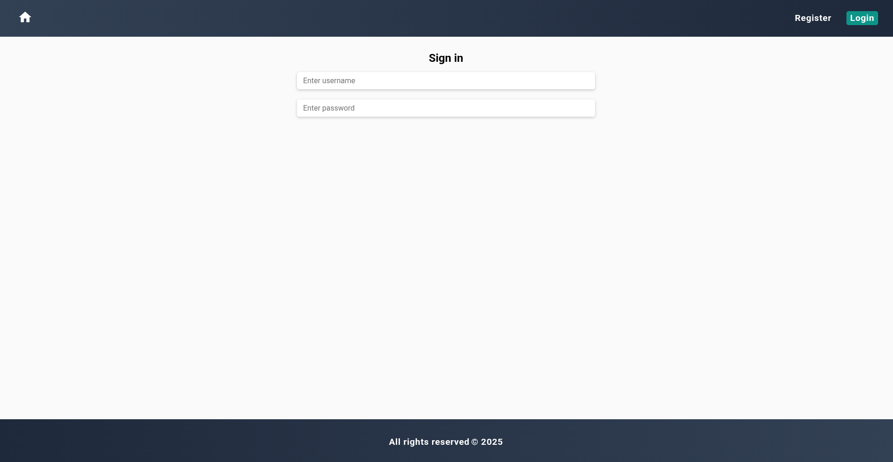

# EventSync

**EventSync** is a full-stack event management application built with Angular and Spring Boot.
Users can register, log in, browse events, and submit feedback, while admins can create new events. 
The application uses AI to analyze feedback sentiment and provide intelligent insights.

**Backend demo:** [Backend API](https://eventsync-production.up.railway.app/swagger-ui/index.html)

## Features

### 👥 Users
- Register and log in with JWT-based authentication
- View available events
- Leave feedback after attending events

### 🛠️ Admins
- Create events

## Tech Stack

- **Frontend:** Angular 20, SCSS
- **Backend:** Java 21, Spring Boot 3+, Spring Security, WebSocket
- **AI Integration:** Sentiment analysis for feedback processing
- **Database:** MySQL
- **Deployment:** Railway (backend)

## UI Preview




## Getting Started

### Prerequisites
- Node.js (version 22+)
- Java 21+
- MySQL database

1. Download or clone this repository.
2. Setup database
- Create a local MySQL database.
- Or use docker `docker run --name mysql-eventsync -e MYSQL_ROOT_PASSWORD=yourpassword -p 3306:3306 -d mysql:latest`
- Access container `docker exec -it mysql-eventsync mysql -u root -p`
- Create database `CREATE DATABASE eventsync`
3. Setup backend
- Open `backend` folder with our ide.
- In the root project directory you will find `.env.example`
- Copy this file to the root project directory.
- Rename it `.env`
- Fill in your database credentials, JWT secret, and any other required values.

```bash
# Database Configuration
DB_URL=jdbc:mysql://localhost:3306/eventsync (or other)
DB_USER=your database login 
DB_PASSWORD=your database password

# JWT Configuration
JWT_SECRET=your secret
JWT_EXPIRATION=your expiration time in ms (example: 86400000)

# API Configuration
API_KEY=your ai api key
API_URL=your ai api url
```

- Launch the backend with your ide or `./mvnw spring-boot:run` or `docker compose up --build`
- Currently, to become an admin, you need to manually assign the `ROLE_ADMIN` role in the database.

4. Setup frontend
- Open frontend folder with your favorite ide. Open terminal and make sure you are in `/frontend` directory.
And type `npm install`
- Start the frontend with `ng serve -o` or `docker compose up --build`
- If browser is not opened automatically type in url `localhost:4200`


### Endpoints 

Base url `localhost:8080/api/v1`

### Authentication

- POST `/auth/register` - Register new user
- POST `/auth/login` - User login
- POST `/auth/logout` - User logout

### Events

- GET `/events` - Get all events
- POST `/events` - Create new event (Admin only)
- GET `/events/{eventId}` - Get event by id

### Feedback

- GET `/events/{eventId}/feedback` - Get event feedback by id
- POST `/events/{eventId}/feedback` - Create feedback for event
- GET `/events/{eventId}/summary` - Get event summary by id

## Author
Ovidijus Eitminavičius
